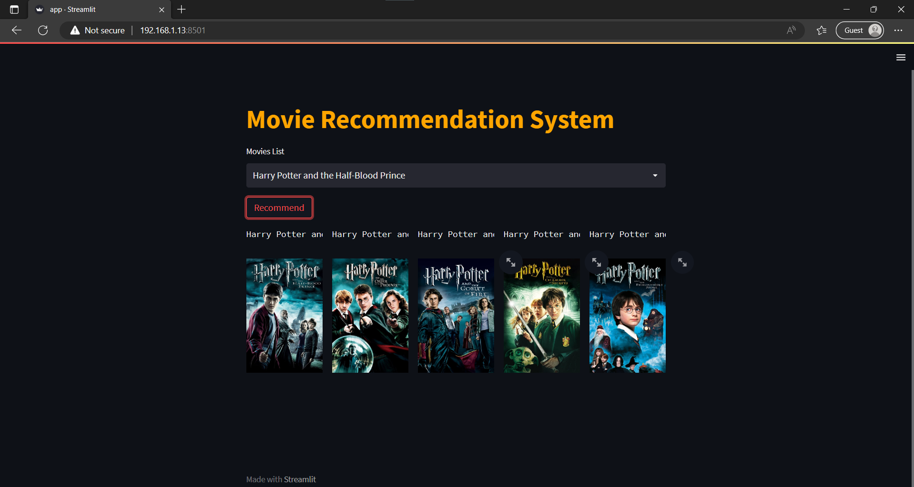

# Movie Recommendation System

This project recommends the Top 5 most similar movies for a given input movie, using cosine-similarity.

## Output Screenshot:

  
  

### Dataset used: 
https://www.kaggle.com/datasets/tmdb/tmdb-movie-metadata

### Steps followed:
1. Importing required libraries, datasets and Merging the 2 datasets.
2. Dealing with null and missing data values.
3. Performing Tranformations on datasets.
4. Using a technique called "Bag of words", 
Concatenate all tags from all the movies to form large string.
Use the top frequently occuring 5000 words, for each movie calculate the frequency each word.
Repeat this process for all movies. 
5. We get a dataframe of shape(5000,5000) 5000->movies 5000->words.
For each movie, find the closest vectors for recommendation, using cosine-similarity

6. Save the model.

### To run the App:
1. Download the datasets and store within same folder.
2. Run Movie_Recommender.ipynb
3. Run : streamlit run app.py 

